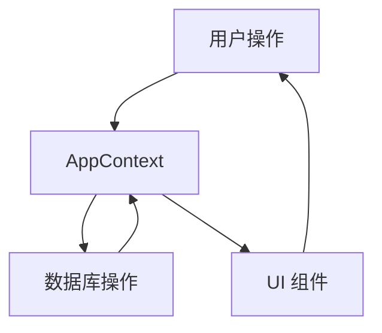

# 专属工具箱项目架构文档

## 项目概览

专属工具箱是一个基于 React + TypeScript + Tailwind CSS 的单页应用，用于管理和快速访问常用工具。

**核心功能**：
- 卡片式布局展示工具
- 预设工具加载
- 分类筛选
- 自定义分类管理
- 搜索功能
- 添加/编辑/删除工具
- 收藏/取消收藏
- 数据导出/导入
- 深色/浅色主题切换
- 响应式布局

## 技术栈

| 技术 | 版本 | 用途 |
|------|------|------|
| React | 19.1.0 | 前端框架 |
| TypeScript | 5.8.3 | 类型安全 |
| Tailwind CSS | 3.4.17 | 样式框架 |
| Vite | 6.3.5 | 构建工具 |
| Dexie.js | 4.0.11 | IndexedDB 封装 |
| Lucide React | 0.511.0 | 图标库 |
| UUID | 11.1.0 | 生成唯一ID |

## 目录结构

```
toolbox/
├── public/             # 静态资源
│   └── vite.svg        # Vite 默认图标
├── src/                # 源代码
│   ├── components/     # UI 组件
│   │   ├── Button.tsx           # 按钮组件
│   │   ├── CategoryDialog.tsx   # 分类管理弹窗
│   │   ├── CategoryTabs.tsx     # 分类标签栏
│   │   ├── ConfirmDialog.tsx    # 确认对话框
│   │   ├── Dialog.tsx           # 基础对话框组件
│   │   ├── ExportDialog.tsx     # 导出数据弹窗
│   │   ├── FileInput.tsx        # 文件输入组件
│   │   ├── Footer.tsx           # 页脚组件
│   │   ├── Header.tsx           # 头部组件
│   │   ├── ImportDialog.tsx     # 导入数据弹窗
│   │   ├── Input.tsx            # 输入框组件
│   │   ├── SearchBar.tsx        # 搜索栏组件
│   │   ├── Select.tsx           # 选择器组件
│   │   ├── Textarea.tsx         # 文本域组件
│   │   ├── ThemeToggle.tsx      # 主题切换组件
│   │   ├── Toast.tsx            # 提示消息组件
│   │   ├── ToolCard.tsx         # 工具卡片组件
│   │   ├── ToolDialog.tsx       # 工具编辑/添加弹窗
│   │   └── ToolGrid.tsx         # 工具网格布局
│   ├── context/        # 状态管理
│   │   └── AppContext.tsx       # 全局状态管理
│   ├── data/           # 预设数据
│   │   └── presetTools.ts       # 预设工具数据
│   ├── db/             # 数据层
│   │   └── database.ts          # IndexedDB 配置
│   ├── types/          # TypeScript 类型
│   │   └── index.ts             # 类型定义
│   ├── App.tsx         # 应用主组件
│   ├── index.css       # 全局样式
│   ├── main.tsx        # 应用入口
│   └── vite-env.d.ts   # Vite 类型声明
├── index.html          # HTML 模板
├── package.json        # 项目配置
├── postcss.config.js   # PostCSS 配置
├── tailwind.config.js  # Tailwind CSS 配置
├── tsconfig.json       # TypeScript 配置
├── tsconfig.node.json  # TypeScript 节点配置
└── vite.config.ts      # Vite 配置
```

## 核心模块说明

### 1. 状态管理 (`AppContext.tsx`)

**功能**：
- 全局状态管理（工具列表、分类列表、搜索关键词等）
- 数据操作方法（添加、更新、删除工具和分类）
- 主题切换
- 弹窗管理
- 数据导入/导出

**关键方法**：
- `loadData()` - 加载数据
- `addTool()` - 添加工具
- `updateTool()` - 更新工具
- `deleteTool()` - 删除工具
- `toggleFavorite()` - 切换收藏状态
- `addCategory()` - 添加分类
- `updateCategory()` - 更新分类
- `deleteCategory()` - 删除分类
- `exportData()` - 导出数据
- `importData()` - 导入数据
- `toggleTheme()` - 切换主题

### 2. 数据层 (`database.ts`)

**功能**：
- IndexedDB 数据库初始化
- 工具和分类的 CRUD 操作
- 预设工具数据加载

**数据库结构**：
- `tools` 表 - 存储工具信息
- `categories` 表 - 存储分类信息

### 3. 组件结构

**基础组件**：
- `Button` - 按钮组件
- `Input` - 输入框组件
- `Select` - 选择器组件
- `Textarea` - 文本域组件
- `FileInput` - 文件输入组件
- `Dialog` - 基础对话框组件

**业务组件**：
- `ToolCard` - 工具卡片
- `ToolGrid` - 工具网格布局
- `CategoryTabs` - 分类标签栏
- `Header` - 头部（包含搜索和操作按钮）
- `Footer` - 页脚
- `ThemeToggle` - 主题切换按钮

**弹窗组件**：
- `ToolDialog` - 添加/编辑工具
- `CategoryDialog` - 管理分类
- `ExportDialog` - 导出数据
- `ImportDialog` - 导入数据
- `ConfirmDialog` - 确认操作
- `Toast` - 提示消息

## 数据流向



1. **用户操作**：用户与界面交互（点击按钮、输入内容等）
2. **状态更新**：AppContext 处理操作，更新状态
3. **数据持久化**：通过 database.ts 与 IndexedDB 交互，持久化数据
4. **UI 渲染**：状态更新触发 UI 组件重新渲染
5. **用户反馈**：用户看到操作结果

## 关键功能实现

### 1. 工具管理

**添加工具**：
- 打开添加工具弹窗
- 填写工具信息（名称、URL、图标、描述、分类）
- 验证表单
- 保存到数据库
- 更新 UI

**编辑工具**：
- 点击工具卡片的编辑按钮
- 打开编辑工具弹窗
- 预填充工具信息
- 修改并验证
- 更新数据库
- 更新 UI

**删除工具**：
- 点击工具卡片的删除按钮
- 弹出确认对话框
- 确认后删除
- 更新数据库
- 更新 UI

### 2. 分类管理

**添加分类**：
- 点击分类标签栏的 + 按钮
- 打开分类管理弹窗
- 输入分类名称
- 保存到数据库
- 更新 UI

**编辑分类**：
- 点击分类标签的编辑按钮
- 打开分类管理弹窗
- 修改分类名称
- 更新数据库
- 更新 UI

**删除分类**：
- 点击分类标签的删除按钮
- 弹出确认对话框
- 确认后删除（同时更新该分类下所有工具的分类）
- 更新数据库
- 更新 UI

### 3. 搜索功能

**实现**：
- 监听搜索输入框变化
- 防抖处理（200ms）
- 实时过滤工具列表
- 显示符合条件的工具

### 4. 主题切换

**实现**：
- 点击主题切换按钮
- 切换 `isDarkMode` 状态
- 更新 body 的 class
- 本地存储主题偏好
- 所有组件自动响应主题变化

### 5. 数据导入/导出

**导出**：
- 打开导出数据弹窗
- 选择导出类型（全部/仅在线工具）
- 生成 JSON 数据
- 下载文件

**导入**：
- 打开导入数据弹窗
- 选择 JSON 文件
- 解析文件内容
- 验证数据格式
- 导入数据到数据库
- 更新 UI

## 响应式设计

**实现**：
- 使用 Tailwind CSS 的响应式类
- 针对不同屏幕尺寸调整布局
- 移动端优化：
  - 调整卡片大小
  - 优化导航栏
  - 确保触控友好

## 性能优化

**措施**：
- 使用 React.memo 优化组件渲染
- 防抖处理搜索输入
- 懒加载组件（如弹窗）
- 优化数据库查询
- 减少不必要的重渲染

## 未来扩展

**可能的扩展**：
- 离线工具包功能
- 工具使用统计
- 工具推荐
- 多语言支持
- 云同步功能
- 自定义主题

## 配置说明

### 1. Tailwind CSS 配置 (`tailwind.config.js`)

**主要配置**：
- 深色模式启用
- 自定义颜色
- 字体设置

### 2. 数据库配置 (`database.ts`)

**配置项**：
- 数据库名称
- 版本号
- 表结构定义
- 预设数据

### 3. 项目配置 (`package.json`)

**依赖**：
- 核心依赖（React、TypeScript 等）
- 开发依赖（Vite、Tailwind CSS 等）

## 开发流程

1. **安装依赖**：`npm install`
2. **开发模式**：`npm run dev`
3. **构建**：`npm run build`
4. **预览**：`npm run preview`

## 部署说明

**静态部署**：
- 构建项目：`npm run build`
- 将 `dist` 目录部署到静态服务器
- 支持任何静态 hosting 服务（GitHub Pages、Vercel、Netlify 等）

**环境要求**：
- 现代浏览器（Chrome、Firefox、Safari、Edge）
- 支持 IndexedDB
- 支持 ES6+ 特性
